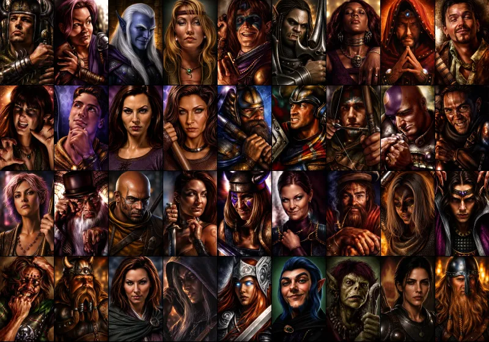
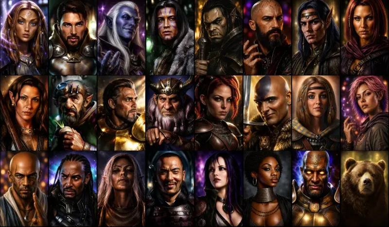



# BG1 Style Portraits
*BG1-style portraits for BG:EE, BG2:EE and EET.*

## Overview

This WeiDU mod aims to improve the quality and consistency of party NPC portraits, especially in EET. Currently it offers BG1/SoD and BG2 NPC portraits, with components for NPC mods planned for future releases. The last milestone would be the custom PC portraits.

The mod supports the vanilla EE UI, LeUI, and Infinity UI++.

## Installation order and mod compatibility

This is primarily a portrait mod and should be installed after content mods that install new NPCs or quests.

There are no compatibility issues known with other mods.

1. Extract the mod to your game or EET mod folder.
2. Run `setup-BG1StylePortraits.exe` (or install via WeiDU against `BG1StylePortraits/BG1StylePortraits.tp2`).
3. Select the components you want at install time.

## Components

### Make NPC portraits unavailable for PC selection *(BG:EE, BG2:EE, and EET)*

This component removes portraits already assigned to NPCs from the `<CHARNAME>` portrait list, so party members keep their unique portraits.

### Add Extended Isandir's Portrait Pack *(BG:EE, BG2:EE, and EET)*

This component adds well-known custom portraits selectable during character creation

### Enhanced BG1 NPC Portraits *(BG:EE, BG2:EE, and EET)*

This component replaces portraits for 36 recruitable NPCs with enhanced BG1-style art.

Each NPC portrait uses three size variants:

- **M** - in-game (zoomed in)
- **L** - character record/inventory (base portrait)
- **r** - additional portrait at the Infinity UI inventory screen (zoomed out)

The majority of the portraits are simply upscaled and enhanced versions of the originals (with added details and lore-accurate fixes, such as removing the pointy ears from the halfling portraits or giving Viconia white hair).
However, a few more controversial decisions were made:

- Faldorn no longer looks like a vampiric Meryl Streep.
- Imoen received a more extensive rework than the others, as I always felt her original portrait was rushed and somewhat disappointing.
- Jaheira... well, this one may be the most controversial. As we know, there is no consistency between her appearance in BG1 and BG2 (and the BG2 version was, frankly, rather unfortunate), so there is no true canon look. For that reason I decided to use Wombat’s Jaheira face and keep it consistent with the upcoming BG2 portraits component.
- Viconia was given some luminescent war paint.
- Xan's face was dehumanized.

See the [BG1 portrait gallery](docs/gallery_bg1.md) for individual portraits.

### Enhanced BG2 NPC Portraits *(BG2:EE and EET)*

This component replaces portraits for recruitable BG2 NPCs with enhanced BG1-style art. 

Each NPC portrait uses three size variants:

- **M** - in-game (zoomed in)
- **L** - character record/inventory (base portrait)
- **r** - additional portrait at the Infinity UI inventory screen (zoomed out)

The majority of the portraits are based on
Wombat's [BG1 Style Portrait Remakes](https://www.nexusmods.com/baldursgate2ee/mods/139?tab=files) which, BTW was the main inspiration for creating this mod. 
Some of them are a bit modified, others are modified a lot. Currently only a special portrait for Edwina is added, but I'm planning to include drow/vampire versions as well. Now, the controversies:

- Edwin, without the hood, with Red Wizards tattoos on his head instead.
- Hmm, actually, I personally see no other controversies.

See the [BG2 portrait gallery](docs/gallery_bg2.md) for individual portraits.

## Credits/thanks

- **Wombat** - main inspiration to BG1ize all the portraits and the original author of most of the BG2 portraits
- **Vasculio** - base/ideas for BG1 portraits enhancements
- **DosEquis** - base/ideas for BG1 portraits enhancements
- **Isandir** - original PC portrait pack
- **Argent77** - exact code for the EE BG2 NPC portrait replacements
- **smeagolheart** - code for introducing Edwina portrait
- **ALIEN, Argent77, Bubb, CamDawg, DavidW, GraionDilach, K4thos, jastey, Pecca** - without their effort there would be no sense in modding the 30 years old game.
- **shaigan** - the mod author

