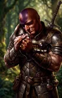
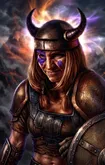
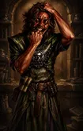

# BG1 NPC Portrait Gallery

[← Back to README](../README.md)

Each NPC portrait uses three size variants:

- **M** - in-game (zoomed in)
- **L** - character record/inventory (base portrait)
- **r** - additional portrait at the Infinity UI inventory screen (zoomed out)

Click a thumbnail to view the full-size portrait.

| | **Ajantis** | | |                                    **Alora**                                      | |
|:---:|:---:|:---:|:---:|:---------------------------------------------------------------------------------:|:---:|
| M | L | r | M |                                         L                                         | r |
|  |  |  |  |  |  |

| |                                      **Baeloth**                                        | | |                                     **Branwen**                                       | |
|:---:|:---------------------------------------------------------------------------------------:|:---:|:---:|:-------------------------------------------------------------------------------------:|:---:|
| M |                                            L                                            | r | M |                                           L                                           | r |
|  |  |  |  |  |  |

| |                                    **Coran**                                      | | |                                   **Dorn**                                     | |
|:---:|:---------------------------------------------------------------------------------:|:---:|:---:|:------------------------------------------------------------------------------:|:---:|
| M |                                         L                                         | r | M |                                       L                                        | r |
|  |  |  |  |  |  |

| |                                      **Dynaheir**                                        | | |                                    **Edwin**                                      | |
|:---:|:----------------------------------------------------------------------------------------:|:---:|:---:|:---------------------------------------------------------------------------------:|:---:|
| M |                                            L                                             | r | M |                                         L                                         | r |
|  |  |  |  |  |  |

| | **Eldoth** |                                                                                     | |                                      **Faldorn**                                        | |
|:---:|:---:|:-----------------------------------------------------------------------------------:|:---:|:---------------------------------------------------------------------------------------:|:---:|
| M | L |                                          r                                          | M |                                            L                                            | r |
|  |  |  |  |  |  |

| | **Garrick** | | |                                    **Imoen**                                      | |
|:---:|:---:|:---:|:---:|:---------------------------------------------------------------------------------:|:---:|
| M | L | r | M |                                         L                                         | r |
|  |  |  |  |  |  |

| | **Jaheira** | | |                                     **Kagain**                                       | |
|:---:|:---:|:---:|:---:|:------------------------------------------------------------------------------------:|:---:|
| M | L | r | M |                                          L                                           | r |
|  |  |  |  |  |  |

| | **Khalid** | | |                                    **Kivan**                                      | |
|:---:|:---:|:---:|:---:|:---------------------------------------------------------------------------------:|:---:|
| M | L | r | M |                                         L                                         | r |
|  |  |  |  |  |  |

| | **Minsc** | | |                                     **Montaron**                                       | |
|:---:|:---:|:---:|:---:|:--------------------------------------------------------------------------------------:|:---:|
| M | L | r | M |                                           L                                            | r |
|  |  |  |  |  |  |

| | **Neera** | | |                                     **Quayle**                                       | |
|:---:|:---:|:---:|:---:|:------------------------------------------------------------------------------------:|:---:|
| M | L | r | M |                                          L                                           | r |
|  |  |  |  |  |  |

| | **Rasaad** | | |                                     **Safana**                                       | |
|:---:|:---:|:---:|:---:|:------------------------------------------------------------------------------------:|:---:|
| M | L | r | M |                                          L                                           | r |
|  |  |  |  |  |  |

| | **Shar-Teel** | | |                                   **Skie**                                     | |
|:---:|:---:|:---:|:---:|:------------------------------------------------------------------------------:|:---:|
| M | L | r | M |                                       L                                        | r |
|  |  |  |  |  |  |

| | **Tiax** | | | **Viconia** |                                                                                        |
|:---:|:---:|:---:|:---:|:---:|:--------------------------------------------------------------------------------------:|
| M | L | r | M | L |                                            r                                           |
|  |  |  |  |  |  |

| | **Xan** | | | **Xzar** |                                                                               |
|:---:|:---:|:---:|:---:|:---:|:-----------------------------------------------------------------------------:|
| M | L | r | M | L |                                       r                                       |
|  |  |  |  |  |  |

| | **Yeslick** | | | **Imoen SoD** |                                                                                                                            |
|:---:|:---:|:---:|:---:|:---:|:--------------------------------------------------------------------------------------------------------------------------:|
| M | L | r | M | L |                                                              r                                                             |
|  |  |  |  |  |  |

| | **Viconia SoD** | | | **Caelar** |                                                                                     |
|:---:|:---:|:---:|:---:|:---:|:-----------------------------------------------------------------------------------:|
| M | L | r | M | L |                                          r                                          |
|  |  |  |  |  |  |

| | **Glint** | | | **M'Khiin** |                                                                                      |
|:---:|:---:|:---:|:---:|:---:|:------------------------------------------------------------------------------------:|
| M | L | r | M | L |                                           r                                          |
|  |  |  |  |  |  |

| | **Schael** | | | **Voghiln** |                                                                                        |
|:---:|:---:|:---:|:---:|:---:|:--------------------------------------------------------------------------------------:|
| M | L | r | M | L |                                            r                                           |
|  |  |  |  |  |  |
