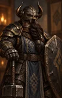
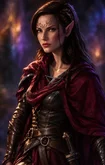

# BG1 Mod NPC Portrait Gallery

[← Back to README](../README.md)

Each NPC portrait uses three size variants:

- **M** - in-game (zoomed in)
- **L** - character record/inventory (base portrait)
- **r** - additional portrait at the Infinity UI inventory screen (zoomed out)

Click a thumbnail to view the full-size portrait.

| Character     | M | L | r |
|:--------------|:---:|:---:|:---:|
| **Arkanis**   |  |  |  |
| **Brage**     |  |  |  |
| **Brandock**  |  |  |  |
| **Breagar**   |  |  |  |
| **Canderous** |  |  |  |
| **Dave**      |  |  |  |
| **Deder**     |  |  |  |
| **Drake**     |  |  |  |
| **Emily**     |  |  |  |
| **Finch**     |  |  |  |
| **Flara**     |  |  |  |
| **Gavin**     |  |  |  |
| **Helga**     |  |  |  |
| **Husam**     |  |  |  |
| **Isra**      |  |  |  |
| **Kale**      |  |  |  |
| **K'Vel**     |  |  |  |
| **Littlun**   |  |  |  |
| **Moidre**    |  |  |  |
| **Mordaine**  |  |  |  |
| **Ophysia**   |  |  |  |
| **Osprey**    |  |  |  |
| **Recorder**  |  |  |  |
| **Sirene**    |  |  |  |
| **Valerie**   |  |  |  |
| **Verr'Sza**  |  |  |  |
| **Vienxay**   |  |  |  |
| **Vynd**      |  |  |  |
