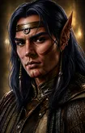

# BG2 NPC Portrait Gallery

[← Back to README](../README.md)

Each NPC portrait uses three size variants:

- **M** - in-game (zoomed in)
- **L** - character record/inventory (base portrait)
- **r** - additional portrait at the Infinity UI inventory screen (zoomed out)

Click a thumbnail to view the full-size portrait.

| | **Aerie** | | | **Anomen** | |
|:---:|:---:|:---:|:---:|:---:|:---:|
| M | L | r | M | L | r |
|  |  |  |  |  |  |

| | **Baeloth** | | | **Cernd** | |
|:---:|:---:|:---:|:---:|:---:|:---:|
| M | L | r | M | L | r |
|  |  |  |  |  |  |

| | **Dorn** | | | **Edwin** | |
|:---:|:---:|:---:|:---:|:---:|:---:|
| M | L | r | M | L | r |
|  |  |  |  |  |  |

| | **Haer'Dalis** | | |                                    **Clara**                                     | |
|:---:|:---:|:---:|:---:|:--------------------------------------------------------------------------------:|:---:|
| M | L | r | M |                                        L                                         | r |
|  |  |  |  |  |  |

| |                                       **Hexxat**                                        | | | **Imoen** | |
|:---:|:---------------------------------------------------------------------------------------:|:---:|:---:|:---:|:---:|
| M |                                            L                                            | r | M | L | r |
|  |  |  |  |  |  |

| | **Jaheira** | | | **Jan** | |
|:---:|:---:|:---:|:---:|:---:|:---:|
| M | L | r | M | L | r |
|  |  |  |  |  |  |

| | **Keldorn** | | | **Korgan** | |
|:---:|:---:|:---:|:---:|:---:|:---:|
| M | L | r | M | L | r |
|  |  |  |  |  |  |

| | **Mazzy** | | | **Minsc** | |
|:---:|:---:|:---:|:---:|:---:|:---:|
| M | L | r | M | L | r |
|  |  |  |  |  |  |

| | **Nalia** | | | **Neera** | |
|:---:|:---:|:---:|:---:|:---:|:---:|
| M | L | r | M | L | r |
|  |  |  |  |  |  |

| | **Rasaad** | | | **Sarevok** | |
|:---:|:---:|:---:|:---:|:---:|:---:|
| M | L | r | M | L | r |
|  |  |  |  |  |  |

| | **Viconia** | | | **Valygar** | |
|:---:|:---:|:---:|:---:|:---:|:---:|
| M | L | r | M | L | r |
|  |  |  |  |  |  |

| | **Wilson** | | | **Yoshimo** | |
|:---:|:---:|:---:|:---:|:---:|:---:|
| M | L | r | M | L | r |
|  |  |  |  |  |  |
