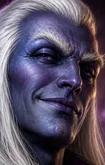
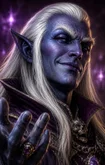
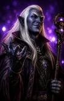
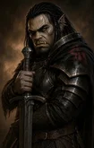
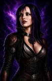
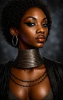
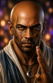
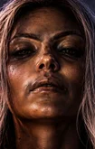
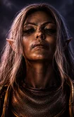
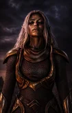

# BG2 NPC Portrait Gallery

[← Back to README](../README.md)

Each NPC portrait uses three size variants:

- **M** - in-game (zoomed in)
- **L** - character record/inventory (base portrait)
- **r** - additional portrait at the Infinity UI inventory screen (zoomed out)

Click a thumbnail to view the full-size portrait.

| Character | M | L | r |
|:---|:---:|:---:|:---:|
| **Baeloth** |  |  |  |
| **Dorn** |  |  |  |
| **Edwin** |  |  |  |
| **Clara** |  |  |  |
| **Hexxat** |  |  |  |
| **Neera** |  |  |  |
| **Rasaad** |  |  |  |
| **Viconia** |  |  |  |
| **Wilson** |  |  |  |
