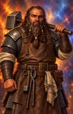
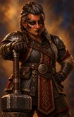
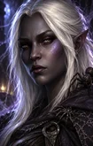
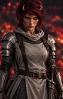

# BG2 Mod NPC Portrait Gallery

[← Back to README](../README.md)

Each NPC portrait uses three size variants:

- **M** - in-game (zoomed in)
- **L** - character record/inventory (base portrait)
- **r** - additional portrait at the Infinity UI inventory screen (zoomed out)

Click a thumbnail to view the full-size portrait.

| Character     |                                                     M                                                     |                                                     L                                                     |                                                     r                                                     |
|:--------------|:---------------------------------------------------------------------------------------------------------:|:---------------------------------------------------------------------------------------------------------:|:---------------------------------------------------------------------------------------------------------:|
| **Adrian**    |      |      |      |
| **Amber**     |      |      |      |
| **Angel**     |      |      |      |
| **Auren**     |      |      |      |
| **Brage**     |      |      |      |
| **Brandock**  |   |   |   |
| **Breagar**   |    |    |    |
| **Deheriana** |  |  |  |
| **Ela**       |            |            |            |
| **Emily**     |      |      |      |
| **Fade**      |         |         |         |
| **Gavin**     |      |      |      |
| **Helga**     |      |      |      |
| **Husam**     |        |        |        |
| **Ninde**     |        |        |        |
| **Isra**      |         |         |         |
| **Kale**      |         |         |         |
| **Kelsey**    |     |     |     |
| **Keto**      |         |         |         |
| **Minyae**    |     |     |     |
| **Pai'na**    |      |      |      |
| **Recorder**  |   |   |   |
| **Saradas**   |     |     |     |
| **Sirene**    |     |     |     |
| **Solaufein** |  |  |  |
| **Vienxay**   |    |    |    |
