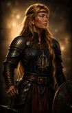
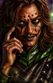
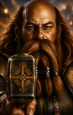
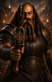

# Returning NPC Portrait Gallery

[← Back to README](../README.md)

Each NPC portrait uses three size variants:

- **M** - in-game (zoomed in)
- **L** - character record/inventory (base portrait)
- **r** - additional portrait at the Infinity UI inventory screen (zoomed out)

Click a thumbnail to view the full-size portrait.

| | **Ajantis** | | | **Alora** | |
|:---:|:---:|:---:|:---:|:---:|:---:|
| M | L | r | M | L | r |
|  |  |  |  |  |  |

| | **Branwen** | | | **Coran** | |
|:---:|:---:|:---:|:---:|:---:|:---:|
| M | L | r | M | L | r |
|  |  |  |  |  |  |

| | **Dynaheir** | | | **Eldoth** | |
|:---:|:---:|:---:|:---:|:---:|:---:|
| M | L | r | M | L | r |
|  |  |  |  |  |  |

| | **Faldorn** | | | **Garrick** | |
|:---:|:---:|:---:|:---:|:---:|:---:|
| M | L | r | M | L | r |
|  |  |  |  |  |  |

| | **Kagain** | | | **Khalid** | |
|:---:|:---:|:---:|:---:|:---:|:---:|
| M | L | r | M | L | r |
|  |  |  |  |  |  |

| | **Kivan** | | | **Montaron** | |
|:---:|:---:|:---:|:---:|:---:|:---:|
| M | L | r | M | L | r |
|  |  |  |  |  |  |

| | **Quayle** | | | **Safana** | |
|:---:|:---:|:---:|:---:|:---:|:---:|
| M | L | r | M | L | r |
|  |  |  |  |  |  |

| | **Shar-Teel** | | | **Skie** | |
|:---:|:---:|:---:|:---:|:---:|:---:|
| M | L | r | M | L | r |
|  |  |  |  |  |  |

| | **Tiax** | | | **Xan** | |
|:---:|:---:|:---:|:---:|:---:|:---:|
| M | L | r | M | L | r |
|  |  |  |  |  |  |

| | **Xzar** | | | **Yeslick** | |
|:---:|:---:|:---:|:---:|:---:|:---:|
| M | L | r | M | L | r |
|  |  |  |  |  |  |

| | **Yoshimo** | |
|:---:|:---:|:---:|
| M | L | r |
|  |  |  |
